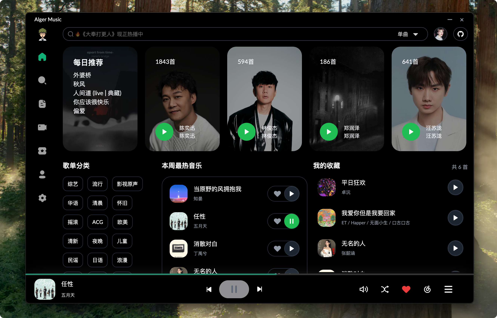
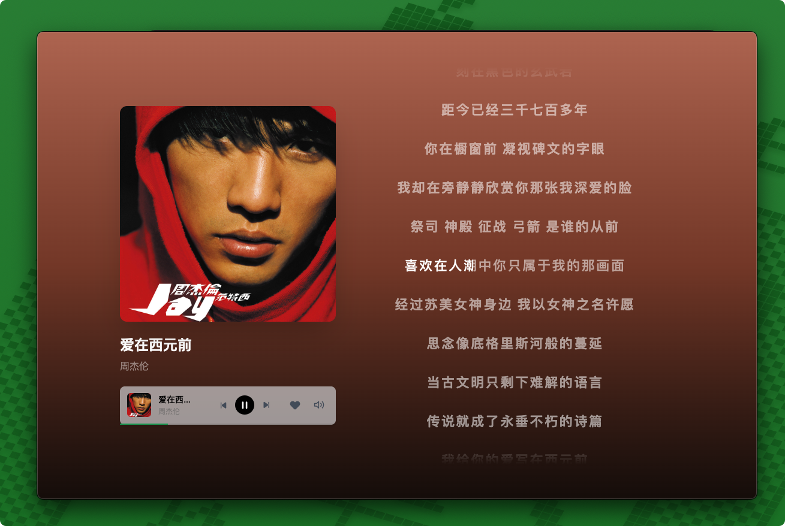
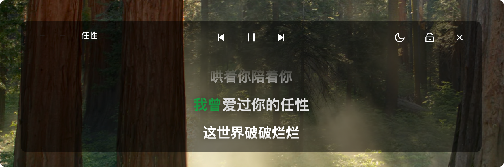
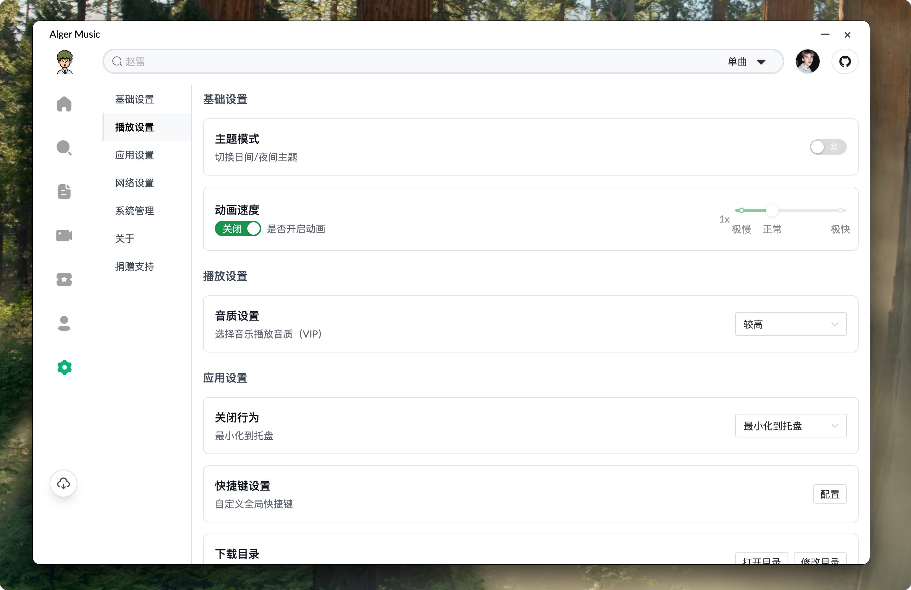
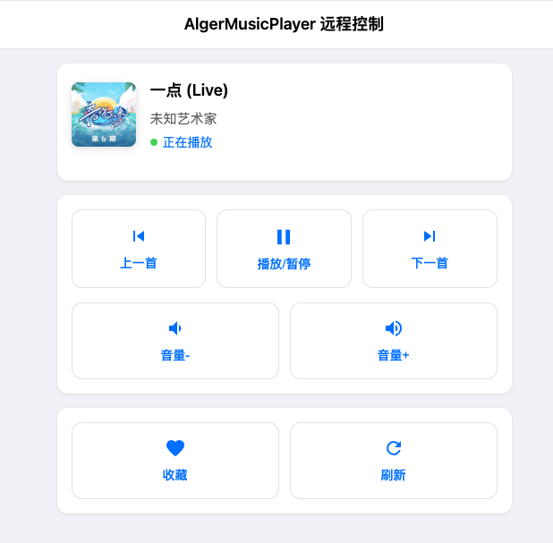

<h2 align="center">🎵 Alger Music Player</h2>
<div align="center">
<div align="center">
  <a href="https://github.com/algerkong/AlgerMusicPlayer/stargazers">
    
  </a>
  <a href="https://github.com/algerkong/AlgerMusicPlayer/releases">
    
  </a>
  <a href="https://pd.qq.com/s/cs056n33q?b=5">
    
  </a>
  <a href="https://t.me/+9efsKRuvKBk2NWVl">
    
  </a>
   <a href="https://donate.alger.fun/">
    
  </a>
</div>
</div>
<div align="center">
  <a href="https://hellogithub.com/repository/607b849c598d48e08fe38789d156ebdc" target="_blank"></a>
</div>

[项目下安装以及常用问题文档](https://www.yuque.com/alger-pfg5q/ip4f1a/bmgmfmghnhgwghkm?singleDoc#)

主要功能如下

- 🎵 音乐推荐
- 🔐 网易云账号登录与同步
- 📝 功能
  - 播放历史记录
  - 歌曲收藏管理
  - 歌单 MV 排行榜 每日推荐
  - 自定义快捷键配置（全局或应用内）
- 🎨 界面与交互
  - 沉浸式歌词显示（点击左下角封面进入）
  - 独立桌面歌词窗口
  - 明暗主题切换
  - 迷你模式
  - 状态栏控制
  - 多语言支持
- 🎼 音乐功能
  - 支持歌单、MV、专辑等完整音乐服务
  - 音乐资源解析（基于 @unblockneteasemusic/server）
  - EQ均衡器
  - 定时播放 远程控制播放 倍速播放
  - 高品质音乐
  - 音乐文件下载
  - 搜索 MV 音乐 专辑 歌单 bilibili
  - 音乐单独选择音源解析
- 🚀 技术特性
  - 本地化服务，无需依赖在线API (基于 netease-cloud-music-api)
  - 全平台适配（Desktop & Web & Mobile Web & Android<测试> & ios<后续>）

## 项目简介

一个第三方音乐播放器、本地服务、桌面歌词、音乐下载、最高音质

## 预览地址

[http://music.alger.fun/](http://music.alger.fun/)

## 软件截图








## 项目启动

```bash
npm install
npm run dev
```

## 开发文档

点击这里[开发文档](./DEV.md)

## 赞赏☕️

[赞赏列表](http://donate.alger.fun/)
| 微信赞赏 | 支付宝赞赏 |
| :--------------------------------------------------------------------------------: | :--------------------------------------------------------------------------------: |
|  <br><small>喝点咖啡继续干</small> |  <br><small>来包辣条吧~</small> |

## 项目统计

[](https://starchart.cc/algerkong/AlgerMusicPlayer)


## 欢迎提Issues

## 声明

本软件仅用于学习交流，禁止用于商业用途，否则后果自负。
希望大家还是要多多支持官方正版，此软件仅用作开发教学。
