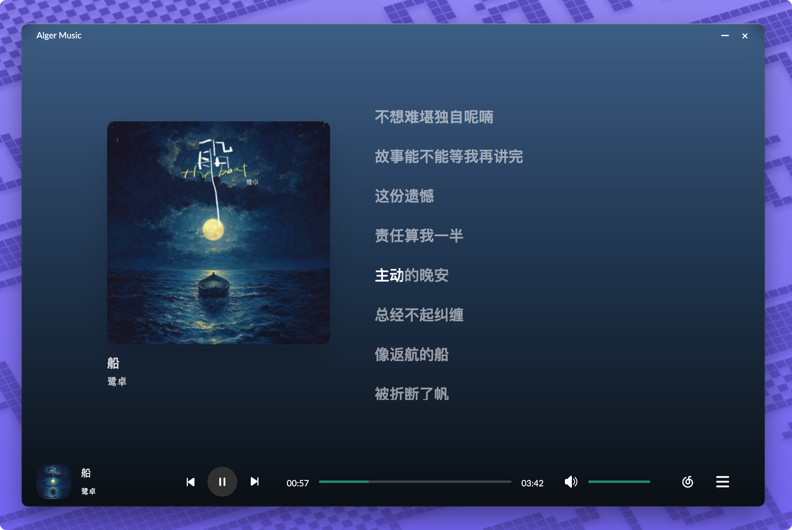
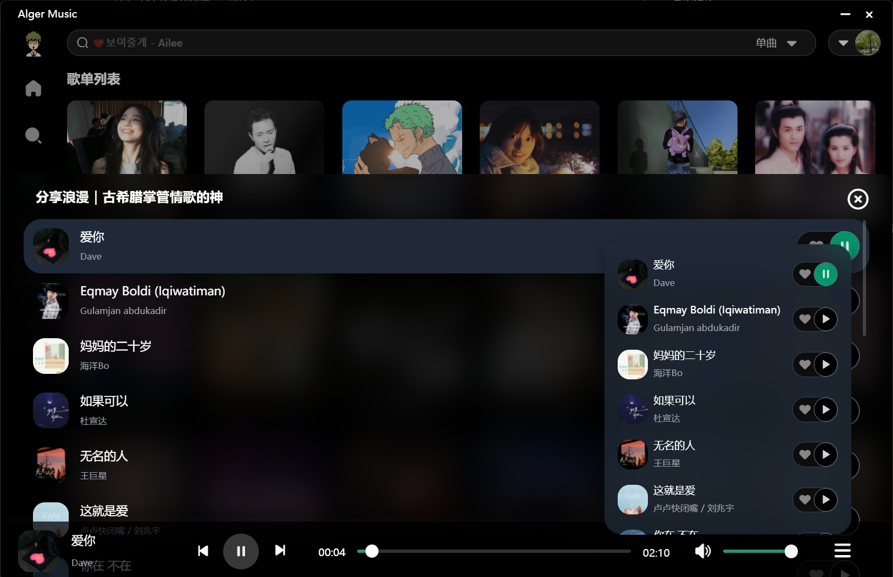
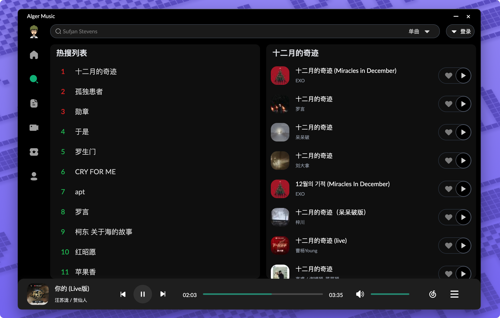
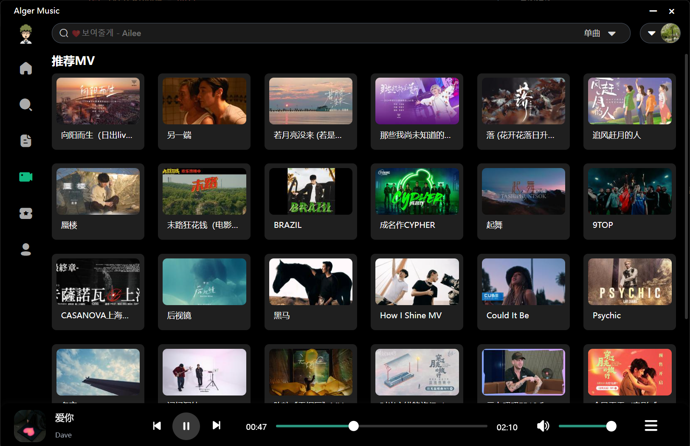
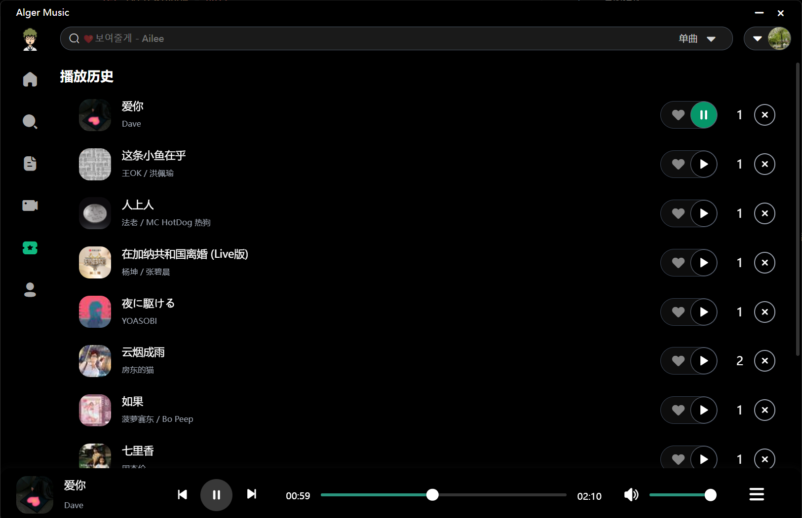
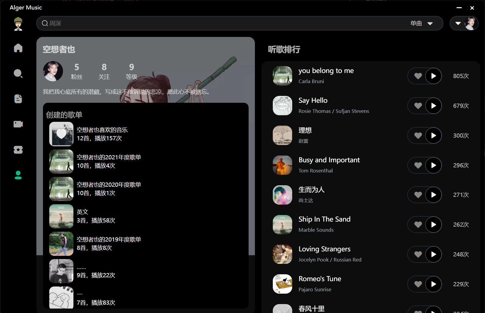

# Alger Music Player
主要功能如下

- 音乐推荐
- 音乐播放
- 网易云登录
- 播放历史
- 桌面歌词
- 歌单 mv 搜索 专辑等功能

## 项目简介
 一个基于 electron typescript vue3 的桌面音乐播放器 适配 web端 桌面端 web移动端

## 预览地址
[http://mc.alger.fun/](http://mc.alger.fun/)

## Stargazers over time
[](https://starchart.cc/algerkong/AlgerMusicPlayer)

## 软件截图








## 技术栈

### 主要框架
- Vue 3 - 渐进式 JavaScript 框架
- TypeScript - JavaScript 的超集，添加了类型系统
- Electron - 跨平台桌面应用开发框架
- Vite - 下一代前端构建工具

### UI 框架
- Naive UI - 基于 Vue 3 的组件库

### 项目特点
- 完整的类型支持（TypeScript）
- 模块化设计
- 自动化组件和 API 导入
- 多平台支持（Web、Desktop、Mobile Web）
- 构建优化（代码分割、压缩）

## 咖啡☕️
|                                        微信                                        |                                       支付宝                                       |
| :--------------------------------------------------------------------------------: | :--------------------------------------------------------------------------------: |
|  |  |

## 项目运行
```bash
  # 安装依赖
  npm install

  # 运行项目 web
  npm run dev

  # 运行项目 electron
  npm run start

  # 打包项目 web
  npm run build

  # 打包项目 electron
  npm run win ... 
  # 具体看 package.json
```
#### 注意
- 本地运行需要配置 .env.development 文件
- 打包需要配置 .env.production 文件

```bash
  # .env.development
  # 你的接口地址 (必填)
  VITE_API = ***
  # 音乐破解接口地址
  VITE_API_MUSIC = ***
  # 代理地址
  VITE_API_PROXY = ***


  # 本地运行代理地址
  VITE_API_PROXY = /api
  VITE_API_MUSIC_PROXY = /music
  VITE_API_PROXY_MUSIC = /music_proxy

  # .env.production
  # 你的接口地址 (必填)
  VITE_API = ***
  # 音乐破解接口地址
  VITE_API_MUSIC = ***
  # 代理地址
  VITE_API_PROXY = ***
```


## 欢迎提Issues

## 免责声明
本软件仅用于学习交流，禁止用于商业用途，否则后果自负。
