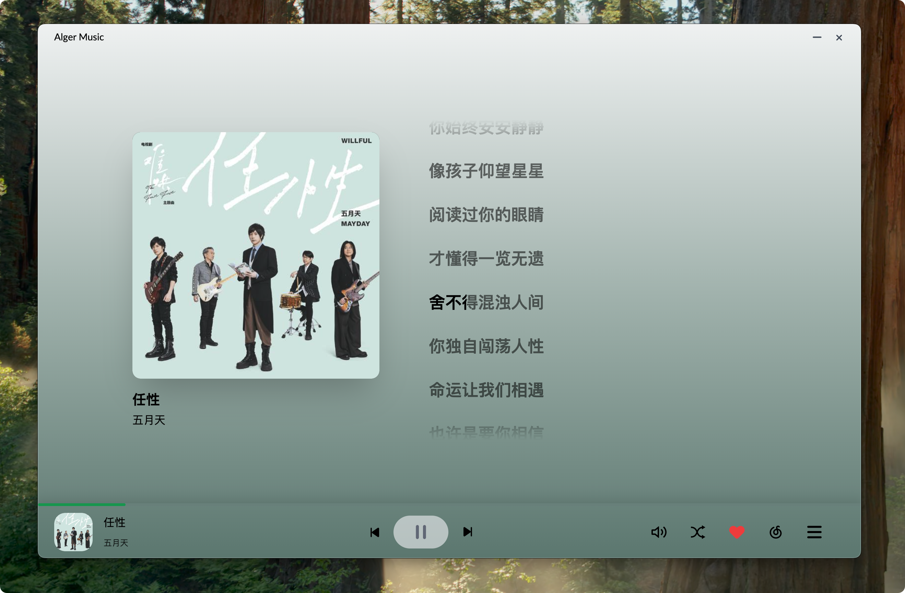

# Alger Music Player
主要功能如下
- 🎵 音乐推荐
- 🔐 网易云账号登录与同步
- 📝 功能
  - 播放历史记录
  - 歌曲收藏管理
  - 自定义快捷键配置
- 🎨 界面与交互
  - 沉浸式歌词显示（点击左下角封面进入）
  - 独立桌面歌词窗口
  - 明暗主题切换
- 🎼 音乐功能
  - 支持歌单、MV、专辑等完整音乐服务
  - 灰色音乐资源解析（基于 @unblockneteasemusic/server）
  - 高品质音乐试听（需网易云VIP）
  - 音乐文件下载（支持右键下载和批量下载）
- 🚀 技术特性
  - 本地化服务，无需依赖在线API (基于 netease-cloud-music-api)
  - 自动更新检测
  - 全平台适配（Desktop & Web & Mobile Web）

## 项目简介
 一个基于 electron typescript vue3 的桌面音乐播放器 适配 web端 桌面端 web移动端

## 预览地址
[http://mc.alger.fun/](http://mc.alger.fun/)

QQ群:789288579

## 软件截图

## 技术栈

### 主要框架
- Vue 3 - 渐进式 JavaScript 框架
- TypeScript - JavaScript 的超集，添加了类型系统
- Electron - 跨平台桌面应用开发框架
- Vite - 下一代前端构建工具
- Naive UI - 基于 Vue 3 的组件库

## 赞赏☕️
[赞赏列表](http://donate.alger.fun/)
|                                        微信赞赏                                        |                                       支付宝赞赏                                       |
| :--------------------------------------------------------------------------------: | :--------------------------------------------------------------------------------: |
|   <small>喝点咖啡继续干</small> |   <small>来包辣条吧~</small> |

## 项目统计

## 欢迎提Issues

## 免责声明
本软件仅用于学习交流，禁止用于商业用途，否则后果自负。
