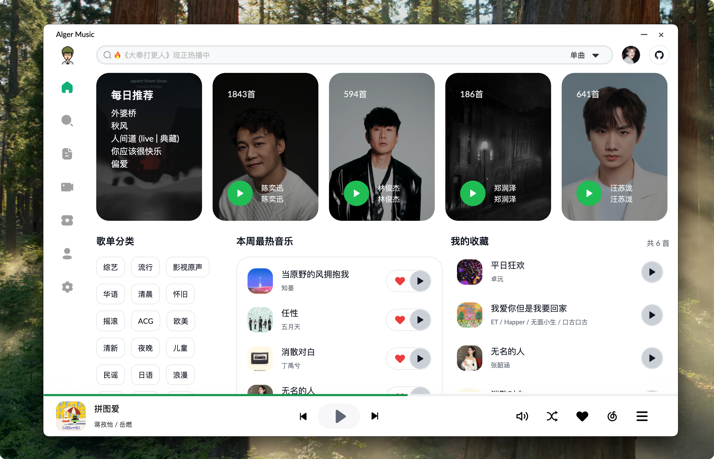
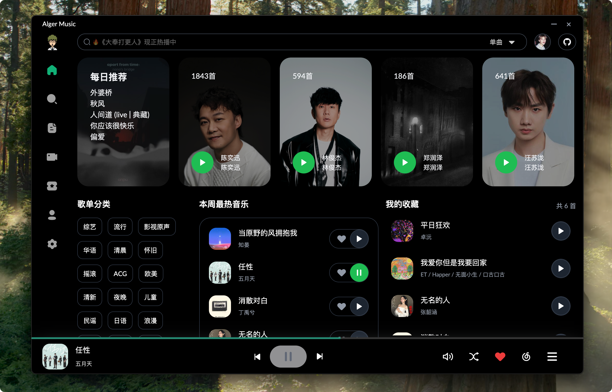
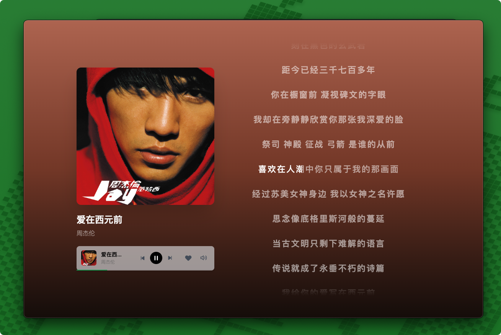
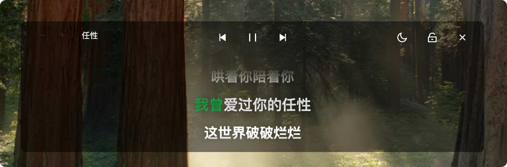
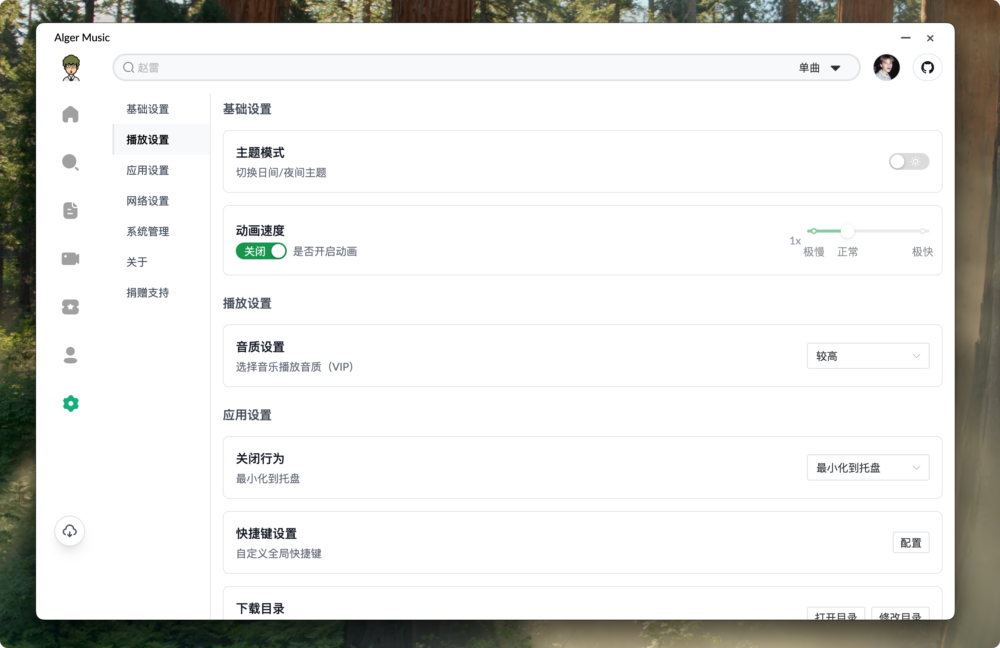
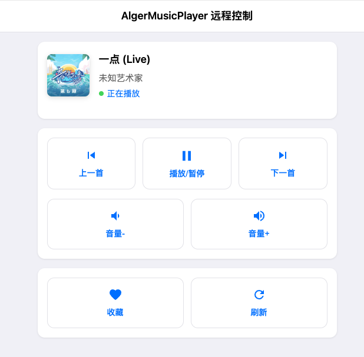

<h2 align="center">🎵 Alger Music Player</h2>
<div align="center">
<div align="center">
  <a href="https://github.com/algerkong/AlgerMusicPlayer/stargazers">
    
  </a>
  <a href="https://github.com/algerkong/AlgerMusicPlayer/releases">
    
  </a>
  <a href="https://pd.qq.com/s/cs056n33q?b=5">
    
  </a>
  <a href="https://t.me/+9efsKRuvKBk2NWVl">
    
  </a>
   <a href="https://donate.alger.fun/">
    
  </a>
</div>
</div>
<div align="center">
  <a href="https://hellogithub.com/repository/607b849c598d48e08fe38789d156ebdc" target="_blank"></a>
</div>

[项目下安装以及常用问题文档](https://www.yuque.com/alger-pfg5q/ip4f1a/bmgmfmghnhgwghkm?singleDoc#)

主要功能如下

- 🎵 音乐推荐
- 🔐 账号登录与同步
- 📝 功能
  - 播放历史记录
  - 歌曲收藏管理
  - 歌单 MV 排行榜 每日推荐
  - 自定义快捷键配置（全局或应用内）
- 🎨 界面与交互
  - 沉浸式歌词显示（点击左下角封面进入）
  - 独立桌面歌词窗口
  - 明暗主题切换
  - 迷你模式
  - 状态栏控制
  - 多语言支持
- 🎼 音乐功能
  - 支持歌单、MV、专辑等完整音乐服务
  - 音乐资源解析（基于 @unblockneteasemusic/server）
  - EQ均衡器
  - 定时播放 远程控制播放 倍速播放
  - 高品质音乐
  - 音乐文件下载
  - 搜索 MV 音乐 专辑 歌单 bilibili
  - 音乐单独选择音源解析
- 🚀 技术特性
  - 本地化服务，无需依赖在线API (基于 netease-cloud-music-api)
  - 全平台适配（Desktop & Web & Mobile Web & Android<测试> & ios<后续>）

## 项目简介

一个第三方音乐播放器、本地服务、桌面歌词、音乐下载、最高音质

## 预览地址

[http://music.alger.fun/](http://music.alger.fun/)

## 软件截图








## 项目启动

```bash
npm install
npm run dev
```

## Docker 部署

容器会同时提供 Web 页面、内置 Netease API 和音乐解析服务。默认只对外开放 Web 端口 `4488`；内部 API 端口 `30488` 无需也不应映射到宿主机。

### 快速启动

Docker Engine 或 Docker Desktop 启动后，直接运行：

```bash
docker run -d \
  --name alger-music-player \
  --restart unless-stopped \
  -p 4488:4488 \
  ghcr.io/algerkong/alger-music-player:latest
```

浏览器访问 <http://localhost:4488>。使用仓库内的 Compose 配置时运行：

```bash
docker compose up -d
```

需要从当前源码构建时运行：

```bash
docker compose build --pull
docker compose up -d
```

首次通过工作流发布镜像后，仓库维护者需要在 GitHub Packages 中确认 `ghcr.io/algerkong/alger-music-player` 已关联本仓库并设为 **Public**，否则匿名用户无法拉取。

### 配置

| 配置 | 默认值 | 说明 |
| --- | --- | --- |
| 宿主机端口 | `4488` | 修改 `-p 4488:4488` 左侧的数字即可更换，例如 `-p 8080:4488`。 |
| `PORT` | `4488` | 容器内 Web 服务端口，通常无需修改。 |
| `NCM_API_PORT` | `30488` | 容器内部 Netease API 端口，不要映射到宿主机。 |
| `MUSIC_SOURCES` | `migu,kugou,kuwo,pyncmd` | 逗号分隔的音乐解析音源。 |

### 验证与更新

```bash
docker ps --filter name=alger-music-player
docker logs alger-music-player
curl http://localhost:4488/healthz
```

健康检查正常时会返回 `{"status":"ok","ncmApi":"ok"}`。更新 Compose 部署：

```bash
docker compose pull
docker compose up -d
```

`docker run` 部署需先 `docker pull ghcr.io/algerkong/alger-music-player:latest`，再删除并使用相同参数重建容器。发布工作流同时提供 `latest`、`main` 和 `sha-*` 标签；生产环境可使用 `sha-*` 固定具体版本。

### 常见问题与公网部署

- Docker 命令无响应：确认 Docker Desktop 或 Docker Engine 已启动。
- 端口被占用：将宿主机端口改为其他值，例如 `-p 8080:4488`。
- 容器启动后无法访问：先检查 `docker ps` 和 `docker logs alger-music-player`，并确认防火墙或云安全组已放行宿主机端口。
- `/healthz` 返回错误：检查容器日志与内部服务启动状态；搜索、登录和音乐解析还要求容器能够访问外网。
- GHCR 拉取失败：确认镜像已发布且包可见性为 Public；私有包需要先执行 `docker login ghcr.io`。

公网部署时请在容器前配置支持 TLS、保留原始 `Host` 且传递 `X-Forwarded-Proto` 的反向代理，并按访问规模增加鉴权或限流；不要直接暴露内部端口 `30488`。

## 开发文档

点击这里[开发文档](./DEV.md)

## 赞赏☕️

[赞赏列表](http://donate.alger.fun/)
| 微信赞赏 | 支付宝赞赏 |
| :--------------------------------------------------------------------------------: | :--------------------------------------------------------------------------------: |
|  <br><small>喝点咖啡继续干</small> |  <br><small>来包辣条吧~</small> |

## 项目统计

[](https://starchart.cc/algerkong/AlgerMusicPlayer)


## 欢迎提Issues

## 声明

本软件仅用于学习交流，禁止用于商业用途，否则后果自负。
希望大家还是要多多支持官方正版，此软件仅用作开发教学。
